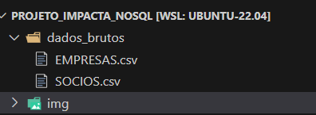
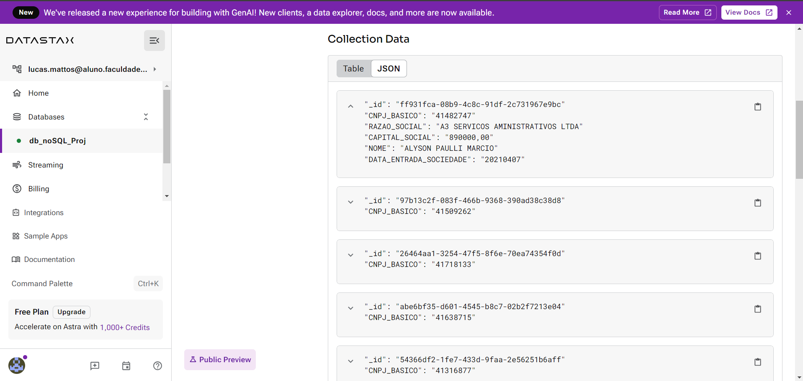
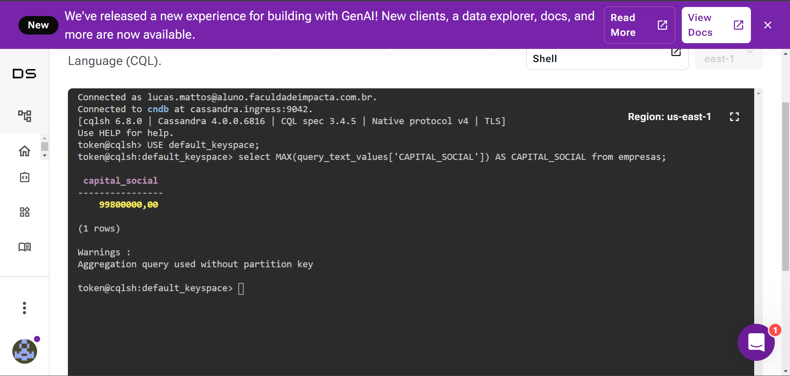
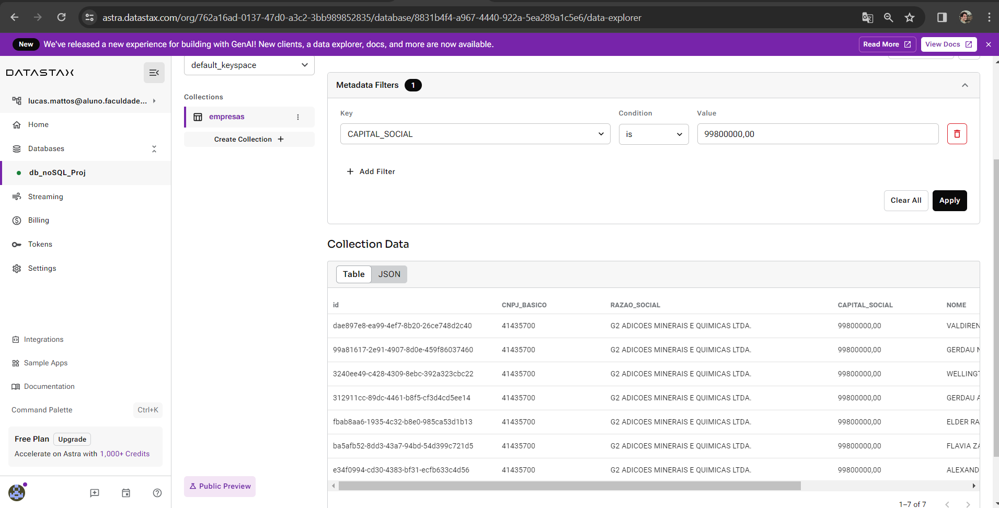
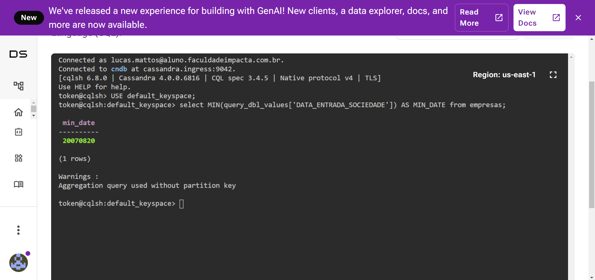
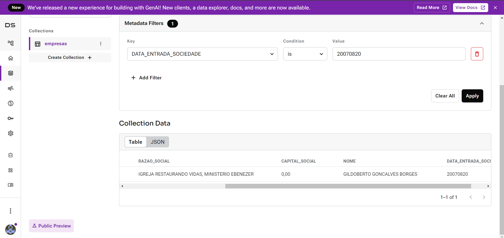
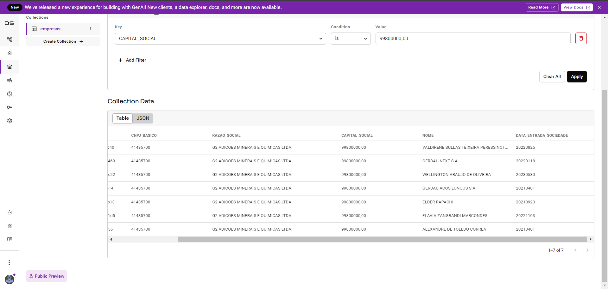

### Trabalhando os dados no ASTRA (Cassandra)

Nesta sessão vamos manipular os dados dentro do serviço do `DATASTAX`.

<b>Sobre os dados que vamos utilizar:</b>

Utilizaremos os arquivos `EMPRESAS.csv` e `SOCIOS.csv` do site `GOV.BR`

* EMPRESAS: Uma amostra de registros contendo o nome da empresa e seu capital social.

* SOCIOS: Uma amostra de registros contendo o nome dos socios de uma determinada empresa e sua data de entrada.

Foi criado na raíz do projeto uma pasta chamada "dados_brutos", onde deixamos guardados estes arquivos.



<b>O que vamos fazer com os dados:</b>

Primeiramente vamos analisar os dados dos dois arquivos separadamente e responder algumas perguntas sobre eles:

1. EMPRESAS:
- Qual o nome da empresa que possui o maior capital social? 

2. SOCIOS:
- Qual o nome do Socio que está a mais tempo numa determinada empresa?

Depois vamos juntar os dois arquivos e responder outras questões:

- Quais são os nomes dos Sócios da empresa que possui o maior capital social?
- Qual o nome da empresa que possui o socio mais antigo? 

<b>Sobre a carga dos dados:</b>

Neste passo optamos por inclui os dados na plataforma via driver do ASTRA, segue abaixo trecho de código do qual inicializamos uma sessão:

````python
from astrapy.db import AstraDB
from dotenv import load_dotenv

import os

load_dotenv()

# Initialization
db = AstraDB(
  token=os.environ.get("ASTRA_TOKEN2"),
  api_endpoint="https://8831b4f4-a967-4440-922a-5ea289a1c5e6-us-east-1.apps.astra.datastax.com")

print(f"Connected to Astra DB: {db.get_collections()}")
````

Precisamos agora transferir nossos dados, porém antes de tudo vamos criar uma coleção chamada `empresas`, depois vamos transformar nossos arquivos .csv em listas de dicionários para por fim inclui-lós.

As inclusões vão ser feitas dentro da coleção criada. Uma vez feita as inclusões, os dados estarão dentro do sistema `DATASTAX`.

````python
import pandas as pd

collection = db.create_collection("empresas")

df_empresas = pd.read_csv('../dados_brutos/EMPRESAS.csv', sep=';')
df_socios = pd.read_csv('../dados_brutos/SOCIOS.csv', sep=';')

df_inner_join = pd.merge(df_empresas[['CNPJ_BASICO','RAZAO_SOCIAL','CAPITAL_SOCIAL']], \
                         df_socios[['CNPJ_BASICO','NOME','DATA_ENTRADA_SOCIEDADE']], \
                            how="inner", on="CNPJ_BASICO").dropna()

dict_of_dicts_empresas = df_inner_join.T.sample(n=1000).to_dict()

empresas = list(dict_of_dicts_empresas.values())

for empresa in empresas:
    collection.insert_one(empresa)

````

<b>Obs:</b> reparem que por praticidade já incluimos os dois arquivos juntos para dentro da plataforma utilizando o método `merge` da biblioteca pandas.

Feita as inclusões, os dados irão aparecer na página do DATASTAX desta forma abaixo:



<b>Visualização os dados dentro do astra:</b>

Partimos para a fase de responder as questões propostas acima, utilizaremos os comandos `Cassandra Query Language (CQL)` disponibilidado dentro do DATASTAX. 

É importante ressaltar que nossa collection foi criada dentro de uma database padrão da plataforma (default_keyspace). Sempre que formos explorar nossos dados temos sempre que direcionar a database da qual pertence por meio do comando `USE default_keyspace;`

1. Qual o nome da empresa que possui o maior capital social? 

Para chegarmos ao resultado primeiro devemos criar uma query que retorne o valor máximo do capital social da amostra, em seguida usar o resultado encontrado como filtro para encontrar a empresa correspondente. Segue abaixo os comandos e print dos resultados:

(1)

```
select MAX(query_text_values['CAPITAL_SOCIAL']) AS CAPITAL_SOCIAL from empresas;
```



O maior capital social corresponde ao valor de R$ 99.800.000,00.

(2)

Incluindo o valor da query acima no data explorer do DATASTAX.




Portanto podemos afirmar que a empresa <i style="color:red">G2 ADICOES MINERAIS E QUIMICAS LTDA.</i> é a que possui o maior capital social.

2. Qual o nome do Socio que está a mais tempo numa determinada empresa?

Podemos encontrar essa informação no campo DATA_ENTRADA_SOCIEDADE. Quanto mais antiga for a data, maior é o tempo que o socio está vinculado com a empresa. Podemos saber a data mais antiga por meio da função `MIN()`. Segue comando utilizado e print do resultado:

(1)

```
select MIN(query_dbl_values['DATA_ENTRADA_SOCIEDADE']) AS MIN_DATE from empresas;
```



O socio mais antigo entrou na empresa no dia 20 de agosto de 2007.

(2)

Incluindo o valor da query acima no data explorer do DATASTAX.



Concluímos que <i style="color:red">GILDOBERTO GONCALVES BORGES</i> é o socio mais antigo da amostra.

3. Quais são os nomes dos Sócios da empresa que possui o maior capital social?

Como já juntamos as duas tabelas logo no processo de carga dos dados para o DATASTAX, podemos solucionar essa questão utilizando a resolução da primeira questão. 

Logo se utilizarmos o comando `select MAX(query_text_values['CAPITAL_SOCIAL']) AS CAPITAL_SOCIAL from empresas;` e incluir o resultado (99800000,00) no filter no data explorer teremos o seguinte resultado:



Os sócios da empresa de maior capital social da amostra são: <i style="color:red">VALDIRENE SULLAS TEIXEIRA</i>, <i style="color:red">GERDAU NEXT S.A.</i>, <i style="color:red">WELLINGTON ARAUJO DE OLIVEIRA</i>, <i style="color:red">
GERDAU ACOS LONGOS S.A.</i>, <i style="color:red">ELDER RAPACHI</i>, <i style="color:red">
FLAVIA ZANGRANDI MARCONDES</i>e <i style="color:red">ALEXANDRE DE TOLEDO CORREA</i>.

4. Qual o nome da empresa que possui o socio mais antigo? 

O mesmo dito na questão anterior se aplica nesse caso. Como os dados de empresa e socios então todos juntos na mesma tabela, uma vez encontrado o socio mais antigo também encontramos a empresa da qual ele faz parte.


Portanto a empresa que possui o socio mais antigo é a <i style="color:red">IGREJA RESTAURANDO VIDAS, MINISTERIO EBENZER</i>.


