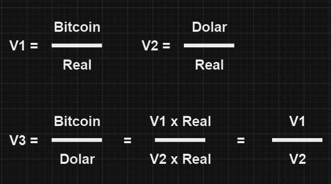
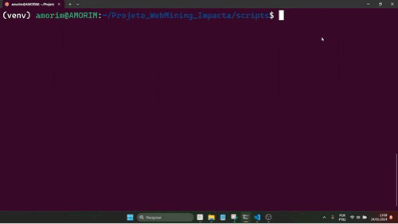

## Trabalho BITCOIN EM DOLARES

Este projeto tem como finalidade saber o valor da moeda virtual Bitcoin em Dolar (USD).<br> 
Ou seja, queremos saber quantos Dólares são necessários para se adquirir 1 Bitcoin.

O processo será dividido em 3 passos:

1. Extração dos recursos
2. Cálculo 
3. Visualização do resultado

#### Como vamos elaborar o projeto ?

Conforme solicitado vamos montar o projeto em um Jupyter Notebook dentro de um<br>subsistema local Linux dentro do Windows (WSL). Para edição e execução usaremos a IDE<br>do Visual Studios Code. 

#### **1. Extração dos recursos**

Para chegarmos aos resultado final precisamos pegar os valores do <b style="color:red">bitcoin em Reais (R$)</b><br> e do <b style="color:red">Dolar em Reais (R$)</b>.

Optei por pegar os valores no site do Google Finance utilizando a biblioteca do `BeautifulSoup`.<br>Além disso vamos precisar da lib `requests` para as requisições HTTP. Para algumas abordagens<br>também foi importado a ferramenta de manipulação de strings `regex`.

Links utilizados para a extração:

* BITCOIN >> https://www.google.com/finance/quote/BTC-BRL

* DOLAR >> https://www.google.com/finance/quote/USD-BRL

Segue abaixo os códigos para a extração dos valores web.

<b>ABORDAGEM 1:</b>

Os valores estão sendo extraídos por meio dos métodos REGEXs.

* POSSÍVEIS VANTAGENS: Se a página não muda muito o layout ou/e muda com frequência<br>os atributos de identificação (tags / class / id), não haverá manutenção recorrente<br>do código.

* POSSÍVEIS DESVANTAGENS: Grandes variações nos valores de um dia<br>para o outro ao ponto de alterar suas casas decimais. Mudanças no layoff do site podem <br>fazer com que os valores desejados não sejam os primeiros na lista de busca.

````python
from bs4 import BeautifulSoup
import requests
import re #regex

def get_usd_brl():

    url = f"https://www.google.com/finance/quote/USD-BRL"
    page = requests.get(url)
    soup = BeautifulSoup(page.content, "html.parser")
    main_content = str(soup.find('body').contents)

    processes_filtered = re.findall("\d\.\d\d\d\d",main_content)
    return processes_filtered[0]


def get_btc_brl():

    url = f"https://www.google.com/finance/quote/BTC-BRL"
    page = requests.get(url)
    soup = BeautifulSoup(page.content, "html.parser")
    main_content = str(soup.find('body').contents)

    processes_filtered = re.findall("\d\d\d,\d\d\d\.\d\d",main_content)
    return processes_filtered[0]

values = [

    get_btc_brl(),
    get_usd_brl()

]

````

<b>ABORDAGEM 2:</b>

A busca dos dados é feita chamando a `tag` e `class` do elemento WEB.

* POSSÍVEIS VANTAGENS: Teremos mais certeza de que o código esta trazendo<br>o dado correto.

* POSSÍVEIS DESVANTAGENS: Manutenção constante do código.

````python
from bs4 import BeautifulSoup
import requests

exchanges = ["BTC-BRL","USD-BRL"]
tag = "div"
class_ = "YMlKec fxKbKc"

values = []

for exchange in exchanges:
    url = f"https://www.google.com/finance/quote/{exchange}"
    page = requests.get(url)
    soup = BeautifulSoup(page.content, "html.parser")
    content = soup.find_all(tag,class_ = class_)[0].text
    values.append(content)
````

#### **2. Cálculo**

Nesta etapa não tem muito mistério, temos 2 valores que são resultados da razão<br>entre unidades monetárias distintas:

1. Bitcoin / Real
2. Dólar / Real

Mas podemos notar que ambas as razões possuem a unidade monetária Real.

Se usarmos álgebra, encontraremos o valor do Bitcoin em Dólar. 



Portanto nós conseguimos afirmar que o valor do <b style="color:red">Bitcoin em Dolar</b> corresponde a divisão<br>do Bitcoin em Real com o Dólar em real.

O cálculo em python pode ser visto logo abaixo:

````python
v1 = float(values[0].replace(",",""))
v2 = float(values[1])

v3 = v1 / v2
````

#### **3. Visualização do resultado**

Chegamos a parte final do projeto, nesta etapa apenas mostramos os resultados dos<br>valores. A visualização acontecerá no console do terminal. 

Vale mencionar que os valores que foram trazidos da internet estão no padrão norte americano.<br>Para transforma-lós no padrão brasileiro, importei a biblioteca `locale` e o formato foi alterado.

Segue abaixo o código de visualização:

````python
import locale

locale.setlocale(locale.LC_ALL,"pt_BR.UTF-8")

V1 = locale.currency(v1, grouping=True, symbol=None)
V2 = locale.currency(v2, grouping=True, symbol=None)
V3 = locale.currency(v3, grouping=True, symbol=None)

print(
    f"""
        Valores extraidos da internet:\n
        Bitcoin em Reais = R$ {V1}\n
        Dolar em Reais = R$ {V2}\n
        \n
        RESULTADO:\n
        Bitcoin em Dolar = $ {V3}

    """
)
````

OBS: Pode ser que precise alterar a linguagem do seu sistema caso queira rodar o código acima.

#### **EXTRA: gifs demonstrativos**

Com o intuito de mostrar a funcionalidade do projeto, inclui abaixo dois gifs:

* O primeiro gif mostra a execução do projeto no notebook.

* O segundo gif mostra as duas abordagens sendo executados via terminal.

<b>GIF 1:</b><br><br>


<br><br>

<b>GIF 2:</b><br><br>

