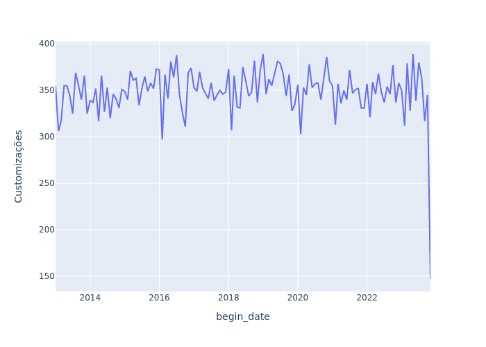
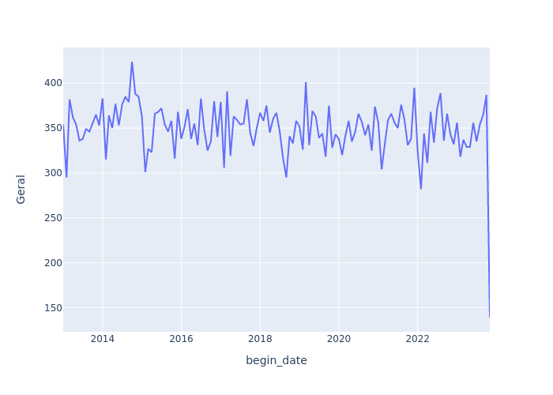
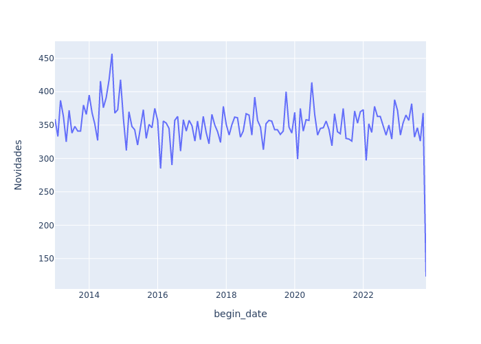
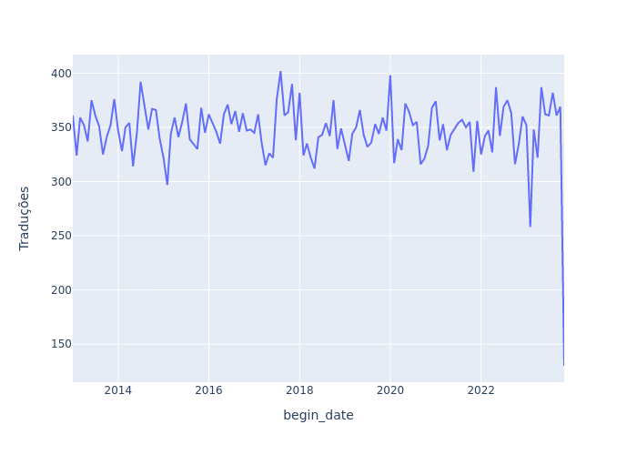

# Trabalho Big Data Arquitect

<h3>Simulação do case:</h3>

Há um site chamado <a href="https://ludopedia.com.br/">ludopedia</a> direcionado a jogos de tabuleiro, usuários não só podem comprar jogos de forma online como também participar de uma comunidade ativa em fóruns. Vamos supor que o time de desenvolvimento está estudando formas de acompanhar as atividades destes fóruns sem ter que mexer no código fonte do site. 

Imagine que temos uma empresa de consultoria e fomos contratados para entregar uma solução para o time.

<h3>Sobre os fóruns:</h3>

Os <a href="https://ludopedia.com.br/forum?v=foruns">fóruns</a> estão listados da seguinte forma:

* <b>Novidades:</b> Fórum para discussões sobre os lançamentos mundiais, impressões e expectativas sobre o que vem por ai.
* <b>Análises:</b> Espaço reservado para análises, resenhas e melhores táticas dos jogos.
* <b>Dúvida de Regras:</b> Dúvidas sobre regras e variantes de jogos.
* <b>Jogatinas:</b> Relatos de jogatinas, eventos, encontros e convenções.
* <b>Customizações:</b> Espaço reservado para recomendações e técnicas de pinturas, exposição de miniaturas pintadas, homemades, print and play e novos projetos.
* <b>Traduções:</b> Espaço reservado para bate papo sobre trabalhos de traduções de jogos.
* <b>Oficina de Jogos:</b> Espaço reservado para bate papo de designers, ilustradores e autores para divulgação de projetos, idéias, playtestes e trabalhos relacionados.
* <b>Geral:</b> Apresente-se e converse sobre assuntos diversos do mundo de jogos de tabuleiro.
* <b>Podcasts:</b> Espaço para divulgação de Podcasts sobre jogos de Tabuleiro.
* <b>Aprenda a Jogar e Estratégias:</b> Espaço para apresentar as regras de um jogo e compartilhar estratégias.
* <b>Ajuda Ludopedia:</b> Conheça as funcionalidades da Ludopedia e coloque aqui suas dúvidas e sugestões.
* <b>Fora da Redoma:</b> Espaço reservado para bate-papos para assuntos fora do mundo de jogos de tabuleiro.

Cada forúm contém tópicos sobre um determinado jogo, é por lá que usuários interagem por meio de posts.

<h3>Sobre nossa solução:</h3>

Nossa ideia é desenvolver um pipeline dividido em 3 etapas:

1. Extração dos dados do site utilizando linguagem `Python` com a biblioteca do `BeautifulSoup`, salvando-os no formato `.parquet`
2. Transformação dos dados brutos para analise por meio do `Databricks` dentro da nuvem `Azure`
3. Envio do relatório para o cliente final usando um bot do Slack 

Todo o processo orquestrado utilizando `Airflow`.


Conforme podemos observar no diagrama acima criamos uma instância do Databricks dentro dos serviços em nuvem da Azure. Dentro dessa instância adicionamos um Notebook para cada etapa. Ainda dentro do Databricks desenvolvemos 3 jobs, cada um com a finalidade de executar um Notebook. Por fim criamos uma DAG do Airflow que aciona automaticamente os jobs do Databricks em um determinado horario do dia.

Sobre a optica da arquitetura medalhão, na camada bronze os dados brutos que extraimos do site são armazenados em parquet sem nenhuma alteração, na camada silver é aonde de fato transformamos o dado até sua forma final e na camada gold o dado está pronto para ser usado como objeto de análise pelo usuário. 


<h3>Sobre o dado:</h3>

Olhando a sessão fóruns dentro do site, percebemos que há uma granularidade:


No nível 1 temos n fóruns (F2,F3,Fn), cada fórum pode conter um conjunto de n tópicos (T1,T2,Tn) representado pelo nível 2, que por sua vez pode ter um conjunto de n posts (P1,P2,Pn) no nível 3. Vamos pegar o dado referente aos posts por estar no ultimo nível da granularidade, aonde teremos um maior grau de detalhamento.

Portanto vamos extrair os seguintes dados de post:

* Nome do usuário
* Data da postagem
* Nome do tópico da qual pertence
* Nome do fórum que faz parte
* Link da página onde ele aparece

<h2>AVISO IMPORTANTE</h2>

Antes de passarmos para as etapas do pipeline, há certos pontos a serem informados:

1. O processo de extração funciona bem para pequenos volumes de dados, a finalidade do case é trabalhar com volumes grandes e o site possui isso, contudo mesmo se a gente quisesse pegar uma pequena parte para cumprir os requisitos minimos dos 500 mil registros, com a infra que estamos utilizando (Runner com 14 GB de memória, 4 núcleos) levaria um bom tempo para pegar tudo de uma só vez. 

2. Então para cumprir com o exigido fizemos o seguinte: pegamos 2000 registros de dados reais do site com nosso script e criamos 500 mil registros falsos pegando os dados reais como base.

<h3>ETAPA 1: Extração</h3>

Dentro da instância do Databricks criamos um workspace para nossos Notebooks.


O primeiro Notebook `1-extracao-dados-ludo` processa os seguintes objetos dentro do seu script:

* A classe <i>Post</i> que armazena temporariamente os dados em seus atributos.
* A função <i>random_date</i> que retorna uma data aleatoria entre uma data inicial e outra final.
* A função <i>pegaPosts</i> que pega as informações de post dentro de um link e retorna uma lista de objetos do tipo Post.
* A função <i>salvar_arquivo_parquet</i> que pega a lista de objetos Post e salva suas informações no formato parquet dentro do dbfs do Databricks.
* A função <i>create_mock</i> que cria dados falsos utilizando o dataframe dos dados salvos em parquet.
* Por ultimo há um bloco de código que realiza a extração dos dados reais em loop até que a quantidade de registros superem 2000 linhas, em sequencia cria os 500 mil registros falsos.

Segue abaixo o script utilizado na ETAPA 1:

```python

import requests
import random
from pyspark.sql.functions import lit
from bs4 import BeautifulSoup
from random import randrange
from datetime import timedelta,datetime


dbutils.fs.rm("dbfs:/databricks-results/ludo", True)


class Post:
  def __init__(self, topic_group, topic_name, user_name, post_time,url):
    self.topic_group = topic_group
    self.topic_name = topic_name
    self.user_name = user_name
    self.post_time = post_time
    self.url = url
  
  def __str__(self):
    return str(vars(self)).replace('{','(').replace('}',')')
  
  def __repr__(self):
    return str(self)


def random_date(start, end):
    """
    This function will return a random datetime between two datetime 
    objects.
    """
    delta = end - start
    int_delta = (delta.days * 24 * 60 * 60) + delta.seconds
    random_second = randrange(int_delta)
    return start + timedelta(seconds=random_second)

def pegaPosts(URL):
    page = requests.get(URL)

    soup = BeautifulSoup(page.content, "html.parser")

    page_content = soup.find(id="page-content")
    order_list = page_content.find_all('ol')

    topic_group = order_list[0].find_all('li')[2].text
    topic_name = order_list[0].find_all('li')[3].text


    posts = page_content.find_all("div",class_ = 'post-top-bar')

    list_of_posts =  []

    for post in posts:
        user_name = post.find_all("div",class_ = 'pull-left')[1].find_all("a",class_ = 'post-top-bar-user-xs')[0].text
        post_time = post.find_all("div",class_ = 'pull-left')[1].find_all("small",class_ = 'text-muted block')[0].text
        list_of_posts.append(Post(topic_group,topic_name,user_name,post_time,URL))

    return list_of_posts
    
   
def salvar_arquivo_parquet(list_of_posts,topic_index,page_index):
    path = f"dbfs:/databricks-results/ludo/bronze/t{topic_index}/p{page_index}"
    response = list_of_posts
    df_converted = spark.createDataFrame(response)

    df_converted.write.format("parquet")\
                        .mode("overwrite")\
                        .save(path)

    print(f"Os arquivos foram salvos em {path}")


def create_mock(dataframe):

    d1 = datetime.strptime('1/1/2013 1:30 PM', '%m/%d/%Y %I:%M %p')
    d2 = datetime.strptime('11/12/2023 7:56 PM', '%m/%d/%Y %I:%M %p')

    array_of_topic_group = []

    for row in dataframe.select('topic_group').distinct().collect():
        array_of_topic_group.append(row['topic_group'])

    array_of_topic_name = []

    for row in dataframe.select('topic_name').distinct().collect():
        array_of_topic_name.append(row['topic_name'])

    array_of_user_name = []

    for row in dataframe.select('user_name').distinct().collect():
        array_of_user_name.append(row['user_name'])

    list_of_posts =  []

    for i in range(1,500001):
        print(f"Add mock person id:{i}")
        random_topic_group = random.randint(0, len(array_of_topic_group)-1)
        random_topic_name = random.randint(0, len(array_of_topic_name)-1)
        random_user_name = random.randint(0, len(array_of_user_name)-1)
        random_time = random_date(d1, d2).strftime("%d/%m/%Y %H:%M:%S")

        list_of_posts.append(Post(array_of_topic_group[random_topic_group], \
                                array_of_topic_name[random_topic_name], \
                                array_of_user_name[random_user_name], \
                                random_time, \
                                ''))
        
    return list_of_posts


END = 500001

COUNT = 0 
DOC_END = 0

for i in range(1,END):
    for j in range(1,51):
        try:
            URL = f"https://ludopedia.com.br/topico/{i}?pagina={j}"   
            print(URL)
            list_of_posts = pegaPosts(URL)
            COUNT = COUNT + len(list_of_posts)
            salvar_arquivo_parquet(list_of_posts,i,j)
        except:
            break
    print(COUNT)
    if COUNT > 2000:
        DOC_END = i + 1
        break

mock_data = create_mock(spark.read.parquet("dbfs:/databricks-results/ludo/bronze/*/*"))

salvar_arquivo_parquet(mock_data,DOC_END,1)


```

<h3>ETAPA 2: Transformação</h3>

Temos os dados bruto no parquet, neste passo nós vamos transforma-los em informação. O que queremos entregar para o cliente? Baseado no que nós extraimos, podemos mostrar o seguinte:

1. Os 5 usuários que mais postam no site
2. Os 5 assuntos mais comentados
3. A quantidade de post que cada fórum tem recebido ao longo do tempo

Logo, o segundo Notebook `2-transformacao-dados-ludo` processa os seguintes comandos:

* Agrega todos os dados parquet em um unico dataframe principal <i>(resultado_posts)</i> e adiciona as colunas "data" e "begin_date" baseado na coluna "post_time" .
* Separa o dataframe parquet em outros 3 subconjuntos de dados
* O primeiro subconjunto <i>(resultado_user_name)</i> tem como finalidade responder quais são os 5 usuários que mais postam.
* O segundo subconjunto <i>(resultado_topic_name)</i> tem como finalidade responder quais são os 5 assuntos mais comentados.
* O terceiro subconjunto <i>(df_topic_group)</i> pivoteia os dados e tem como finalidade guardar a quantidade de posts cada fórum tem recebido ao longo do tempo.
* Por fim o código compacta o dataframe principal e os seus subconjuntos e salva-os dentro do dbfs do Databricks em formato CSV.

Segue abaixo o script utilizado na ETAPA 2:

```python

from pyspark.sql.functions import to_date, first, col, round, concat, lit

df_posts = spark.read.parquet("dbfs:/databricks-results/ludo/bronze/*/*")

day = df_posts['post_time'].substr(1,2)
month = df_posts['post_time'].substr(4,5).substr(1,2)
year = concat(lit(20),df_posts['post_time'].substr(7,8).substr(1,2).cast('string'))
year2 = df_posts['post_time'].cast('string').substr(7,8).substr(1,4)

df_posts = df_posts.withColumn('data', when(col('url') != "", to_date(concat(year,lit("-"),month,lit("-"),day))) \
    .otherwise(to_date(concat(year2,lit("-"),month,lit("-"),day)))) 
df_posts = df_posts.withColumn('begin_date', when(col('url') != "", to_date(concat(year,lit("-"),month,lit("-01")))) \
    .otherwise(to_date(concat(year2,lit("-"),month,lit("-01"))))) 

df_topic_group = df_posts.select("begin_date","topic_group")
df_topic_name = df_posts.select("topic_name")
df_user_name = df_posts.select("user_name")
df_posts = df_posts.select("data","topic_group","topic_name","user_name","url")


df_topic_group = df_topic_group.groupBy('begin_date','topic_group').count()

resultado_topic_group = df_topic_group.groupBy("begin_date") \
           .pivot("topic_group") \
           .agg(first("count")) \
           .orderBy("begin_date", ascending=False)

columns =  resultado_topic_group.schema.fields

for column in columns:
    if column.name != 'begin_date':
        resultado_topic_group = resultado_topic_group.na.fill(value=0,subset=[column.name])

resultado_topic_name = df_topic_name.groupBy('topic_name').count().orderBy('count',ascending=False).limit(5).coalesce(1)
resultado_user_name = df_user_name.groupBy('user_name').count().orderBy('count',ascending=False).limit(5).coalesce(1)
resultado_topic_group = resultado_topic_group.coalesce(1)
resultado_posts = df_posts.coalesce(1)

dbutils.fs.rm("dbfs:/databricks-results/ludo/prata", True)

resultado_posts.write\
    .mode ("overwrite")\
    .format("csv")\
    .option("header", "true")\
    .save("dbfs:/databricks-results/ludo/prata/posts")

resultado_topic_group.write\
    .mode ("overwrite")\
    .format("csv")\
    .option("header", "true")\
    .save("dbfs:/databricks-results/ludo/prata/topic_group")

resultado_user_name.write\
    .mode ("overwrite")\
    .format("csv")\
    .option("header", "true")\
    .save("dbfs:/databricks-results/ludo/prata/user_name")

resultado_topic_name.write\
    .mode ("overwrite")\
    .format("csv")\
    .option("header", "true")\
    .save("dbfs:/databricks-results/ludo/prata/topic_name")

```

<h3>ETAPA 3: Envio dos dados</h3>

Após a transformação, o dado está pronto para ser consumido pelo cliente final. O Slack é uma ferramenta de comunicação entre equipes que tem se tornado popular ao longo dos anos, e uma funcionalidade interessante dessa plataforma é a facilidade de criar bots no envio de arquivos e mensagens automáticas. Vamos supor que a equipe de desenvolvimento da ludopedia se comunique via Slack, seria interessante o time receber o levantamento das atividades dos usuarios e os assuntos mais comentados diretamente por esse chat.

Por isso, criamos um workspace onde o bot ira entregar os relatórios e gráficos, as imagens abaixo ilustram esse resultado final.


O terceiro Notebook `3-automatizando-relatorio-ludo` processa os seguintes comandos:

* Se conecta ao client Slack
* Busca os arquivos CSV e cria dataframes com os dados
* Cria uma pasta no dbfs direcionado à armazenagem de imagens
* Faz a plotagem gráfica de alguns dataframes e salva como imagem  
* Envia os arquivos (csv e png) para o bot processar

Segue abaixo o script utilizado na ETAPA 3:

```python

from slack_sdk import WebClient
import pyspark.pandas as ps


slack_token = "<CHAVE-TOKEN-SLACK>"
client = WebClient(token=slack_token)

nome_arquivo = dbutils.fs.ls("dbfs:/databricks-results/ludo/prata/posts/")[-1].name

path = "../../dbfs/databricks-results/ludo/prata/posts/"+nome_arquivo

enviando_arquivo_csv = client.files_upload_v2(
    channel="<CHANNEL-SLACK-ID>",  
    title="Arquivo no formato CSV dos posts do site ludopedia",
    file=path,
    filename="posts.csv",
    initial_comment="Segue anexo o arquivo CSV:",
)


df_topic_group = ps.read_csv("dbfs:/databricks-results/ludo/prata/topic_group/")
df_user_name = ps.read_csv("dbfs:/databricks-results/ludo/prata/user_name/")
df_topic_name = ps.read_csv("dbfs:/databricks-results/ludo/prata/topic_name/")


# !mkdir imagens -------> Use esse comando dentro do notebook

for topic in df_topic_group.columns[1:]:
    fig = df_topic_group.plot.line(x="begin_date",y=topic)
    fig.write_image(f"./imagens/{topic}.png")

fig2 = df_user_name.plot.bar(x="user_name",y='count')
fig2.write_image(f"./imagens/user_name.png")

fig3 = df_topic_name.plot.bar(x="topic_name",y='count')
fig3.write_image(f"./imagens/topic_name.png")

def enviando_imagens(nome):
    enviando_imagens = client.files_upload_v2(
    channel="C069B5ZTX45",  
    title="Enviando imagens",
    file=f"./imagens/{nome}.png"
)

enviando_imagens('topic_name')
enviando_imagens('user_name')

for topic in df_topic_group.columns[1:]:
    enviando_imagens(topic)


```

<h3>Sobre o Airflow:</h3>

O Airflow é uma otima ferramenta para a automatização de rotinas. Aqui nesse case configuramos uma DAG que processa os jobs de extração, transformação e envio do databricks diariamente as 9 da manhã. Segue abaixo a conclusão de um fluxo no airflow:


Segue abaixo o script de construção dessa DAG.

```python

from airflow import DAG
from airflow.providers.databricks.operators.databricks import DatabricksRunNowOperator
from datetime import datetime

with DAG(
    'ludopedia',
    start_date=datetime(2023, 12, 12),
    schedule_interval="0 9 * * *" #Todos os dias as 9 da manhã
    ) as dag_executando_notebook_extracao_ludo:

    extraindo_dados_ludo = DatabricksRunNowOperator(
    task_id = 'Extraindo-posts',
    databricks_conn_id = 'databricks_default',
    job_id = <DATA-BRICKS-JOB-ID>)

    transformando_dados_ludo = DatabricksRunNowOperator(
    task_id = 'Transformando-dados-posts',
    databricks_conn_id = 'databricks_default',
    job_id = <DATA-BRICKS-JOB-ID>)

    enviando_relatorio_ludo = DatabricksRunNowOperator(
    task_id = 'Enviando-relatorio-posts',
    databricks_conn_id = 'databricks_default',
    job_id = <DATA-BRICKS-JOB-ID>)

    extraindo_dados_ludo >> transformando_dados_ludo >> enviando_relatorio_ludo

```

<h3>Gráficos do relatorio final</h3>

Assim concluimos o projeto, deixo aqui as imagens dos graficos enviados ao Slack










