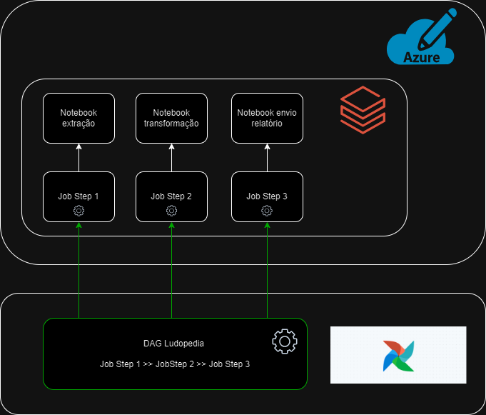

# Trabalho Big Data Arquitect

<h3>Simulação do case:</h3>

Há um site chamado <a href="https://ludopedia.com.br/">ludopedia</a> direcionado a jogos de tabuleiro, usuários não só podem comprar jogos de forma online como também participar de uma comunidade ativa em fóruns. Vamos supor que o time de desenvolvimento está estudando formas de acompanhar as atividades destes fóruns sem ter que mexer no código fonte do site. 

Imagine que temos uma empresa de consultoria e fomos contratados para entregar uma solução para o time.

<h3>Sobre os fóruns:</h3>

Os <a href="https://ludopedia.com.br/forum?v=foruns">fóruns</a> estão listados da seguinte forma:

* <b>Novidades:</b> Fórum para discussões sobre os lançamentos mundiais, impressões e expectativas sobre o que vem por ai.
* <b>Análises:</b> Espaço reservado para análises, resenhas e melhores táticas dos jogos.
* <b>Dúvida de Regras:</b> Dúvidas sobre regras e variantes de jogos.
* <b>Jogatinas:</b> Relatos de jogatinas, eventos, encontros e convenções.
* <b>Customizações:</b> Espaço reservado para recomendações e técnicas de pinturas, exposição de miniaturas pintadas, homemades, print and play e novos projetos.
* <b>Traduções:</b> Espaço reservado para bate papo sobre trabalhos de traduções de jogos.
* <b>Oficina de Jogos:</b> Espaço reservado para bate papo de designers, ilustradores e autores para divulgação de projetos, idéias, playtestes e trabalhos relacionados.
* <b>Geral:</b> Apresente-se e converse sobre assuntos diversos do mundo de jogos de tabuleiro.
* <b>Podcasts:</b> Espaço para divulgação de Podcasts sobre jogos de Tabuleiro.
* <b>Aprenda a Jogar e Estratégias:</b> Espaço para apresentar as regras de um jogo e compartilhar estratégias.
* <b>Ajuda Ludopedia:</b> Conheça as funcionalidades da Ludopedia e coloque aqui suas dúvidas e sugestões.
* <b>Fora da Redoma:</b> Espaço reservado para bate-papos para assuntos fora do mundo de jogos de tabuleiro.

Cada forúm contém tópicos sobre um determinado jogo, é por lá que usuários interagem por meio de posts.

<h3>Sobre nossa solução:</h3>

Nossa ideia é desenvolver um pipeline dividido em 3 etapas:

1. Extração dos dados do site utilizando linguagem `Python` com a biblioteca do `BeautifulSoup`, salvando-os no formato `.parquet`
2. Transformação dos dados brutos para analise por meio do `Databricks` dentro da nuvem `Azure`
3. Envio do relatório para o cliente final usando um bot do Slack 

Todo o processo orquestrado utilizando `Airflow`.

Conforme podemos observar no diagrama acima criamos uma instância do Databricks dentro dos serviços em nuvem da Azure. Dentro dessa instância adicionamos um Notebook para cada etapa. Ainda dentro do Databricks desenvolvemos 3 jobs, cada um com a finalidade de executar um Notebook. Por fim criamos uma DAG do Airflow que aciona automaticamente os jobs do Databricks em um determinado horario do dia.

<h3>Sobre o dado:</h3>

Olhando a sessão fóruns dentro do site, percebemos que há uma granularidade:

No nível 1 temos n fóruns (F2,F3,Fn), cada fórum pode conter um conjunto de n tópicos (T1,T2,Tn) representado pelo nível 2, que por sua vez pode ter um conjunto de n posts (P1,P2,Pn) no nível 3. Vamos pegar o dado referente aos posts por estar no ultimo nível da granularidade, aonde teremos um maior grau de detalhamento.

Portanto vamos extrair os seguintes dados de post:

* Nome do usuário
* Data da postagem
* Nome do tópico da qual pertence
* Nome do fórum que faz parte
* Link da página onde ele aparece

<h2>AVISO IMPORTANTE</h2>

Antes de passarmos para as etapas do pipeline, há certos pontos a serem informados:

1. O processo de extração funciona bem para pequenos volumes de dados, a finalidade do case é trabalhar com volumes grandes e o site possui isso, contudo mesmo se a gente quisesse pegar uma pequena parte para cumprir os requisitos minimos dos 500 mil registros, com a infra que estamos utilizando (Runner com 14 GB de memória, 4 núcleos) levaria um bom tempo para pegar tudo de uma só vez. 

2. Então para cumprir com o exigido fizemos o seguinte: pegamos 2000 registros de dados reais do site com nosso script e criamos 500 mil registros falsos pegando os dados reias como base. Isso consequentemente vai deixar nossos relatorios finais viesados.

<h3>ETAPA 1: Extração</h3>

Dentro da instância do Databricks criamos um workspace para nossos Notebooks.

O primeiro Notebook `1-extracao-dados-ludo` processa os seguintes objetos dentro do seu script:

* A classe <i>Post</i> que armazena temporariamente os dados em seus atributos
* A função <i>random_date</i> que retorna uma data aleatoria entre uma data inicial e outra final
* A função <i>pegaPosts</i> que pega as informações de post dentro de um link e retorna uma lista de objetos do tipo Post
* A função <i>salvar_arquivo_parquet</i> que pega a lista de objetos Post e salva suas informações no formato parquet dentro do dbfs do Databricks
* A função <i>create_mock</i> que cria dados falsos utilizando o dataframe dos dados salvos em parquet
* Por ultimo há um bloco de código realiza a extração dos dados reais em loop até a quantidade registros superarem 2000, em seguida que cria os 500 mil registros falsos.

Segue abaixo o script utilizado na ETAPA 1:

